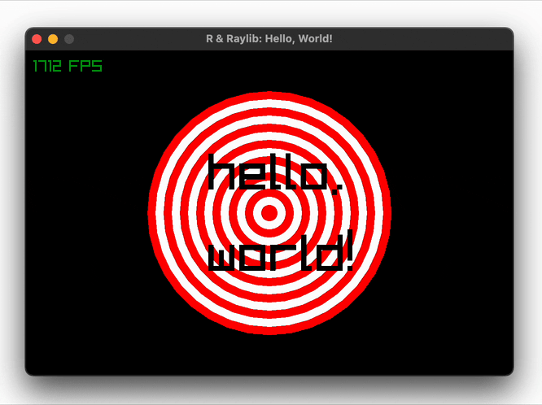
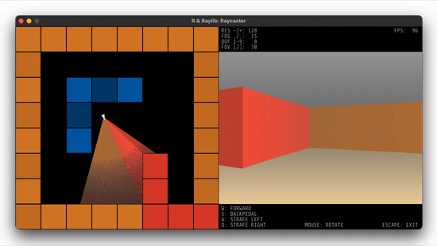
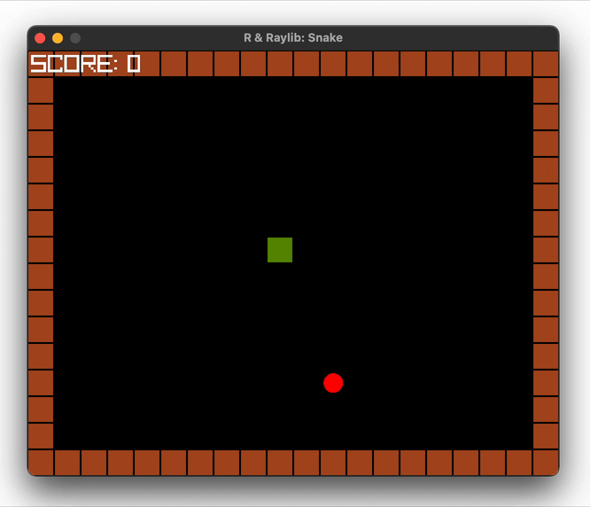
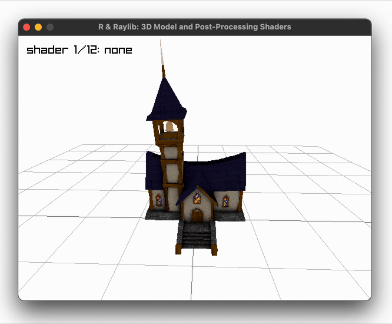
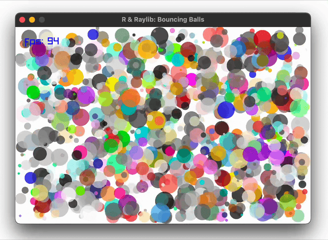
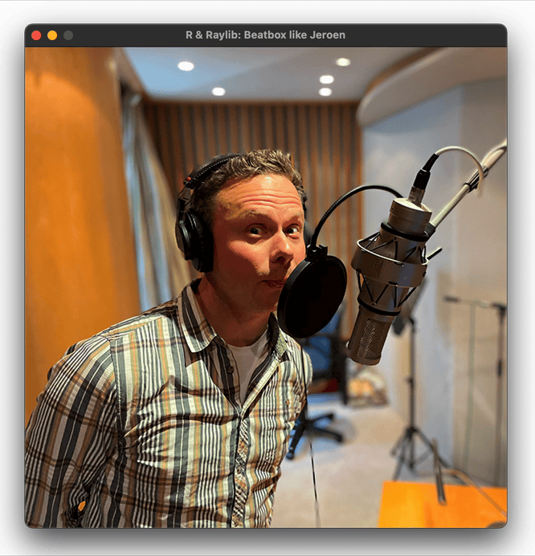

<!-- README.md is generated from README.Rmd. Please edit that file. -->

```{r, include = FALSE}
knitr::opts_chunk$set(
  collapse = TRUE,
  comment = "#>",
  fig.path = "man/figures/README-",
  out.width = "100%"
)
```

# raylibr 

<!-- badges: start -->
<!-- badges: end -->


This R package wraps [Raylib](https://www.raylib.com/), a simple and easy-to-use library to enjoy videogames programming.


## Installation

You can install the development version of `raylibr` from [GitHub](https://github.com/) with:

```{r, eval = FALSE}
remotes::install_github("jeroenjanssens/raylibr")
```

`raylibr` is tested regularly on macOS, Linux, and Windows.


## Features

Raylib, the C library that the `raylibr` package wraps, enables you to work with:

* Real-time 2D and 3D graphics
* Keyboard and mouse interactivity
* Music and sound effects
* Physics simulations and collision detection
* Animated models and shaders
* Multitouch, gesture recognition, and even VR headsets

The `raylibr` package allows you to do all of this from R, and adds the following usability improvements for R users:

* Function and class names are in snake_case (instead of PascalCase used by Raylib)
* Use R vectors and matrices (they're automatically converted to Raylib's `Vector2`, `Vector3`, etc.)
* Vectorized drawing functions (enjoy buttery-smooth animations by letting C++ do the looping)
* Use R color names (e.g., use `"hotpink"` instead of `0xff69b4ff` or `list(r = 255, g = 105, b = 180)`) 
* Use only 8 keys to get started (because `raylibr` is an anagram of `library`)


## Examples

Here's a "Hello, World!" script to give you an idea of how to use `raylibr`. You can run this script using `demo("helloworld", package = "raylibr")`.

```{r, eval = FALSE}
library(raylibr)

init_window(600, 400, "R & Raylib: Hello, World!")

while (!window_should_close()) {
  alpha <- abs(sin(get_time()))
  begin_drawing()
  clear_background("black")
  draw_circle(300, 200, seq(150, 10, by = -10), c("red", "white"))
  draw_text(c("hello,", "world!"), 225, c(120, 220), 64, fade("black", alpha))
  draw_fps(10, 10)
  end_drawing()
}

close_window()
```

This script produces the following animation:



While basic, it illustrates how to create a window, how to draw shapes (in a vectorized manner), and how to work with colors.
Just imagine what you can do if you add a little keyboard interactivity and some sound effects!

Below are a few more examples to whet your appetite.
Run `demo(package = "raylibr")` to see all available demos in R or visit [Raylib's examples page](https://www.raylib.com/examples.html) to see even more examples in C.


### Build your own raycaster

Run `demo("raycaster", package = "raylibr")` to reminisce the 90s and learn how raycasters work. Source: [`demo/raycaster.R`](https://github.com/jeroenjanssens/raylibr/blob/HEAD/demo/raycaster.R)




### Play a game of snake 

Run `demo("snake", package = "raylibr")` to play this game. Use the arrow keys to control the snake. Source: [`demo/snake.R`](https://github.com/jeroenjanssens/raylibr/blob/HEAD/demo/snake.R)




### Load 3D models and apply post-processing shaders

Run `demo("model", package = "raylibr")` to play this demo. Select a different shader with the left and right arrow keys. Source: [`demo/model.R`](https://github.com/jeroenjanssens/raylibr/blob/HEAD/demo/model.R)




### Bounce thousands of transparent balls

Run `demo("balls", package = "raylibr")` to play this demo. Source: [`demo/balls.R`](https://github.com/jeroenjanssens/raylibr/blob/HEAD/demo/balls.R)




### Animate cubes while playing music

Run `demo("cubes", package = "raylibr")` to play this demo. Source: [`demo/cubes.R`](https://github.com/jeroenjanssens/raylibr/blob/HEAD/demo/cubes.R)


### Beatbox like Jeroen

Run `demo("beatbox", package = "raylibr")` to drop some beats. Press the `[a-zA-Z]` keys to play the 52 samples recorded by yours truly. Silence the cacophony by pressing Space. Source: [`demo/beatbox.R`](https://github.com/jeroenjanssens/raylibr/blob/HEAD/demo/beatbox.R)




## Acknowledgements

* [Ramon Santamaria](https://twitter.com/raysan5) for creating [Raylib](https://www.raylib.com/), the C library that makes this all possible.
* [Dirk Eddelbuettel](https://twitter.com/eddelbuettel) and others for creating the [Rcpp package](https://www.rcpp.org/), which enables the interface with Raylib.
* [Mike FC](https://twitter.com/coolbutuseless) for showing me how to [expose C structs as R objects](https://github.com/coolbutuseless/cstructr).
* [Jared Lander](https://twitter.com/jaredlander) and team for allowing me to [present about R & Raylib](https://www.youtube.com/watch?v=Mudz-ykLKbo) at the NYR Conference 2022.  
* [David Robinson](https://twitter.com/drob) for encouraging me to put `raylibr` on GitHub.
* [`raylibr`'s contributors](https://github.com/jeroenjanssens/raylibr/graphs/contributors) for improving `raylibr` by submitting issues and pull requests.


## License

The `raylibr` package is licensed under the MIT License.
