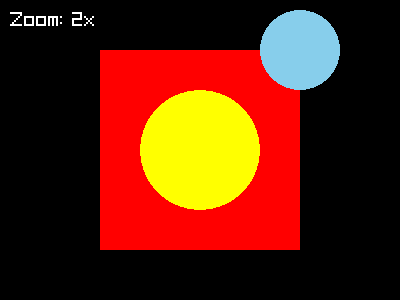
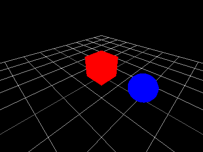
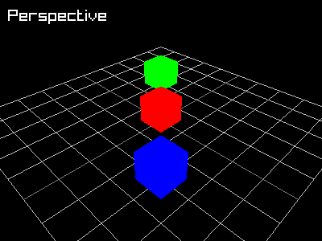
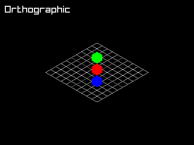

# Camera

raylibr provides both 2D and 3D camera systems. A camera transforms
world coordinates into screen coordinates, letting you pan, zoom, and
rotate your view of the scene.

## 2D camera

[`camera_2d()`](https://jeroenjanssens.github.io/raylibr/reference/camera_2d.md)
creates a 2D camera with four properties:

- **offset** — where the target appears on screen (in pixels)
- **target** — the world position to look at
- **rotation** — angle in degrees
- **zoom** — magnification factor (1.0 = normal)

Wrap your drawing calls in
[`begin_mode_2d()`](https://jeroenjanssens.github.io/raylibr/reference/begin_mode_2d.md)
/
[`end_mode_2d()`](https://jeroenjanssens.github.io/raylibr/reference/end_mode_2d.md)
to apply the camera transform. Anything drawn outside this block uses
screen coordinates directly — useful for HUD elements.

``` r

raylibr_screenshot(function() {
  cam <- camera_2d(c(200, 150), c(100, 100), rotation = 0, zoom = 2)
  begin_mode_2d(cam)
  draw_rectangle(50L, 50L, 100L, 100L, "red")
  draw_circle(100L, 100L, 30.0, "yellow")
  draw_circle(150L, 50L, 20.0, "skyblue")
  end_mode_2d()
  draw_text("Zoom: 2x", 10L, 10L, 20L, "white")
})
```



raylibr image

The rectangle and circles are drawn in world coordinates. The camera
zooms in 2x and centers on `(100, 100)`, so they appear magnified. The
text is drawn outside the camera block, so it stays fixed on screen.

## 3D camera

[`camera_3d()`](https://jeroenjanssens.github.io/raylibr/reference/camera_3d.md)
sets up a 3D perspective view:

``` r

cam <- camera_3d(
  position = c(4, 4, 4),   # where the camera is
  target = c(0, 0, 0),     # what it looks at
  up = c(0, 1, 0),         # which direction is "up"
  fovy = 70,               # vertical field of view in degrees
  projection = camera_projection$perspective
)
```

All parameters except `position` have sensible defaults. Wrap 3D drawing
in
[`begin_mode_3d()`](https://jeroenjanssens.github.io/raylibr/reference/begin_mode_3d.md)
/
[`end_mode_3d()`](https://jeroenjanssens.github.io/raylibr/reference/end_mode_3d.md):

``` r

raylibr_screenshot(function() {
  cam <- camera_3d(c(3, 3, 3))
  begin_mode_3d(cam)
  draw_grid(10L, 1.0)
  draw_cube(c(0, 0.5, 0), 1, 1, 1, "red")
  draw_sphere(c(2, 0.5, 0), 0.5, "blue")
  end_mode_3d()
})
```



raylibr image

The helper
[`raylibr_screenshot_3d()`](https://jeroenjanssens.github.io/raylibr/reference/raylibr_screenshot_3d.md)
provides a shortcut — it sets up a camera at `c(4, 4, 4)`, draws a grid,
and wraps your drawing function automatically.

## Perspective vs orthographic

Perspective projection makes distant objects appear smaller (like real
life). Orthographic projection preserves parallel lines and sizes
regardless of distance — useful for technical or isometric views.

``` r

raylibr_screenshot(function() {
  cam <- camera_3d(c(6, 6, 6), fovy = 45,
                   projection = camera_projection$perspective)
  begin_mode_3d(cam)
  draw_grid(10L, 1.0)
  draw_cube(c(0, 0.5, 0), 1, 1, 1, "red")
  draw_cube(c(2, 0.5, 2), 1, 1, 1, "blue")
  draw_cube(c(-2, 0.5, -2), 1, 1, 1, "green")
  end_mode_3d()
  draw_text("Perspective", 10L, 10L, 20L, "white")
})
```



raylibr image

``` r

raylibr_screenshot(function() {
  cam <- camera_3d(c(6, 6, 6), fovy = 20,
                   projection = camera_projection$orthographic)
  begin_mode_3d(cam)
  draw_grid(10L, 1.0)
  draw_cube(c(0, 0.5, 0), 1, 1, 1, "red")
  draw_cube(c(2, 0.5, 2), 1, 1, 1, "blue")
  draw_cube(c(-2, 0.5, -2), 1, 1, 1, "green")
  end_mode_3d()
  draw_text("Orthographic", 10L, 10L, 20L, "white")
})
```



raylibr image

## Built-in camera modes

For interactive applications,
[`update_camera()`](https://jeroenjanssens.github.io/raylibr/reference/update_camera.md)
provides four built-in control schemes:

``` r

cam <- camera_3d(c(10, 10, 10))

# In the game loop:
update_camera(cam, camera_mode$free)          # WASD + mouse look
update_camera(cam, camera_mode$orbital)       # orbit around target
update_camera(cam, camera_mode$first_person)  # FPS-style controls
update_camera(cam, camera_mode$third_person)  # follow behind target
```

[`update_camera()`](https://jeroenjanssens.github.io/raylibr/reference/update_camera.md)
modifies the camera in place — no need to reassign.

## Manual camera control

For custom camera behavior, use the individual control functions:

``` r

camera_move_forward(cam, distance = 1.0, move_in_world_plane = TRUE)
camera_move_right(cam, distance = 1.0, move_in_world_plane = TRUE)
camera_move_up(cam, distance = 1.0)
camera_move_to_target(cam, delta = -2.0)  # negative = zoom in

camera_yaw(cam, angle = 0.1, rotate_around_target = TRUE)
camera_pitch(cam, angle = 0.1, lock_view = TRUE,
             rotate_around_target = TRUE, rotate_up = FALSE)
camera_roll(cam, angle = 0.1)
```

All of these modify the camera in place.

## Coordinate conversion

Convert between screen and world coordinates:

- `get_screen_to_world_2d(position, camera)` — screen pixel → 2D world
  position
- `get_world_to_screen(position, camera)` — 3D world position → screen
  pixel
- `get_world_to_screen_2d(position, camera)` — 2D world position →
  screen pixel
- `get_screen_to_world_ray(position, camera)` — screen pixel → 3D ray
  (for picking/clicking on 3D objects)

These are essential for mouse interaction — convert the mouse position
to world coordinates, then check for collisions or interactions in world
space.
