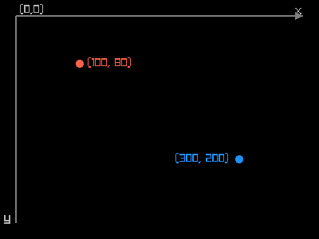
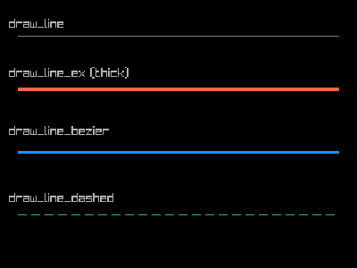
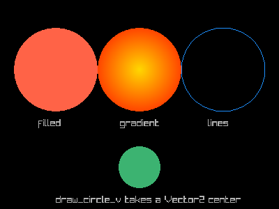
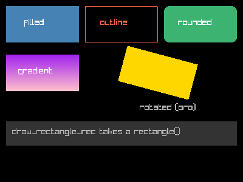
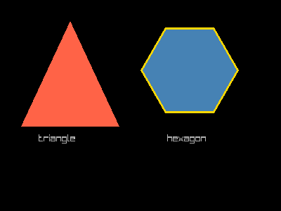
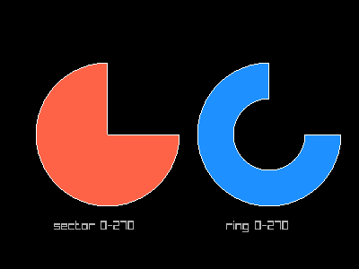
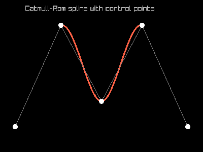
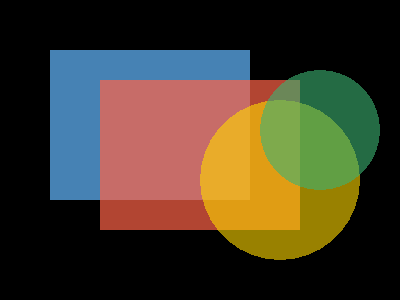

# Drawing 2D Shapes

This guide covers all 2D shape-drawing functions available in raylibr.
Each example uses
[`raylibr_screenshot()`](https://jeroenjanssens.github.io/raylibr/reference/raylibr_screenshot.md)
which creates a hidden 400x300 window with a black background.

## Coordinate system

The origin `(0, 0)` is at the **top-left** corner. X increases to the
right, Y increases downward.

``` r

raylibr_screenshot(function() {
  # Axes
  draw_line_ex(c(20, 20), c(380, 20), 2.0, "grey50")
  draw_line_ex(c(20, 20), c(20, 280), 2.0, "grey50")
  draw_text("x", 370L, 5L, 16L, "grey70")
  draw_text("y", 5L, 265L, 16L, "grey70")
  draw_text("(0,0)", 25L, 5L, 14L, "grey70")
  # Arrowheads
  draw_triangle(c(380, 20), c(370, 15), c(370, 25), "grey50")
  draw_triangle(c(20, 280), c(15, 270), c(25, 270), "grey50")
  # Sample points
  draw_circle(100L, 80L, 5.0, "tomato")
  draw_text("(100, 80)", 110L, 72L, 14L, "tomato")
  draw_circle(300L, 200L, 5.0, "dodgerblue")
  draw_text("(300, 200)", 220L, 192L, 14L, "dodgerblue")
})
```



raylibr image

## Lines

``` r

raylibr_screenshot(function() {
  draw_line(20L, 40L, 380L, 40L, "grey50")
  draw_text("draw_line", 10L, 20L, 14L, "grey70")

  draw_line_ex(c(20, 100), c(380, 100), 4.0, "tomato")
  draw_text("draw_line_ex (thick)", 10L, 75L, 14L, "grey70")

  draw_line_bezier(c(20, 170), c(380, 170), 3.0, "dodgerblue")
  draw_text("draw_line_bezier", 10L, 140L, 14L, "grey70")

  draw_line_dashed(c(20, 240), c(380, 240), 10.0, 5.0, "mediumseagreen")
  draw_text("draw_line_dashed", 10L, 215L, 14L, "grey70")
})
```



raylibr image

[`draw_line_ex()`](https://jeroenjanssens.github.io/raylibr/reference/draw_line_ex.md)
and
[`draw_line_bezier()`](https://jeroenjanssens.github.io/raylibr/reference/draw_line_bezier.md)
take `Vector2` endpoints (two-element numeric vectors) and a thickness
argument.

## Circles

``` r

raylibr_screenshot(function() {
  draw_circle(80L, 100L, 60.0, "tomato")
  draw_text("filled", 55L, 170L, 14L, "grey70")

  draw_circle_gradient(c(200, 100), 60.0, "gold", "orangered")
  draw_text("gradient", 172L, 170L, 14L, "grey70")

  draw_circle_lines(320L, 100L, 60.0, "dodgerblue")
  draw_text("lines", 298L, 170L, 14L, "grey70")

  draw_circle_v(c(200, 240), 30.0, "mediumseagreen")
  draw_text("draw_circle_v takes a Vector2 center", 80L, 280L, 14L, "grey70")
})
```



raylibr image

[`draw_circle()`](https://jeroenjanssens.github.io/raylibr/reference/draw_circle.md)
takes integer center coordinates, while
[`draw_circle_v()`](https://jeroenjanssens.github.io/raylibr/reference/draw_circle_v.md)
takes a `c(x, y)` vector.

## Rectangles

``` r

raylibr_screenshot(function() {
  draw_rectangle(10L, 10L, 120L, 60L, "steelblue")
  draw_text("filled", 40L, 30L, 14L, "white")

  draw_rectangle_lines(140L, 10L, 120L, 60L, "tomato")
  draw_text("outline", 165L, 30L, 14L, "tomato")

  draw_rectangle_rounded(rectangle(270, 10, 120, 60), 0.3, 10L, "mediumseagreen")
  draw_text("rounded", 293L, 30L, 14L, "white")

  draw_rectangle_gradient_v(10L, 90L, 120L, 60L, "purple", "pink")
  draw_text("gradient", 30L, 110L, 14L, "white")

  draw_rectangle_pro(
    rectangle(260, 120, 120, 60),
    c(60, 30), 15.0, "gold"
  )
  draw_text("rotated (pro)", 230L, 170L, 14L, "grey70")

  draw_rectangle_rec(rectangle(10, 200, 380, 40), "grey20")
  draw_text("draw_rectangle_rec takes a rectangle()", 20L, 210L, 14L, "grey70")
})
```



raylibr image

[`draw_rectangle_pro()`](https://jeroenjanssens.github.io/raylibr/reference/draw_rectangle_pro.md)
supports rotation around an origin point.
[`draw_rectangle_rec()`](https://jeroenjanssens.github.io/raylibr/reference/draw_rectangle_rec.md)
and
[`draw_rectangle_rounded()`](https://jeroenjanssens.github.io/raylibr/reference/draw_rectangle_rounded.md)
take a
[`rectangle()`](https://jeroenjanssens.github.io/raylibr/reference/rectangle.md)
struct.

## Triangles and polygons

``` r

raylibr_screenshot(function() {
  draw_triangle(
    c(100, 30), c(30, 180), c(170, 180),
    "tomato"
  )
  draw_text("triangle", 55L, 190L, 14L, "grey70")

  draw_poly(c(270, 100), 6L, 70.0, 0.0, "steelblue")
  draw_text("hexagon", 238L, 190L, 14L, "grey70")

  draw_poly_lines_ex(c(270, 100), 6L, 70.0, 0.0, 3.0, "gold")
})
```



raylibr image

[`draw_poly()`](https://jeroenjanssens.github.io/raylibr/reference/draw_poly.md)
draws a regular polygon: center, number of sides, radius, rotation,
color.
[`draw_poly_lines_ex()`](https://jeroenjanssens.github.io/raylibr/reference/draw_poly_lines_ex.md)
draws its outline with a given thickness.

Note:
[`draw_triangle()`](https://jeroenjanssens.github.io/raylibr/reference/draw_triangle.md)
vertices must be in **counter-clockwise** order, or the triangle won’t
render.

## Arcs and rings

``` r

raylibr_screenshot(function() {
  draw_circle_sector(c(120, 150), 80.0, 0.0, 270.0, 36L, "tomato")
  draw_circle_sector_lines(c(120, 150), 80.0, 0.0, 270.0, 36L, "white")
  draw_text("sector 0-270", 60L, 245L, 14L, "grey70")

  draw_ring(c(300, 150), 40.0, 80.0, 0.0, 270.0, 36L, "dodgerblue")
  draw_ring_lines(c(300, 150), 40.0, 80.0, 0.0, 270.0, 36L, "white")
  draw_text("ring 0-270", 252L, 245L, 14L, "grey70")
})
```



raylibr image

Angles are in degrees. `0` points right, and the arc sweeps
**counter-clockwise**. The `segments` parameter controls smoothness
(more segments = smoother curves).

## Splines

Spline functions take a matrix of control points (one row per point, two
columns for x and y):

``` r

pts <- matrix(c(
  30, 250,
  120, 50,
  200, 200,
  280, 50,
  370, 250
), ncol = 2, byrow = TRUE)

raylibr_screenshot(function() {
  draw_spline_catmull_rom(pts, 3.0, "tomato")
  draw_spline_linear(pts, 1.0, "grey50")
  # Draw control points
  for (i in seq_len(nrow(pts))) {
    draw_circle(as.integer(pts[i, 1]), as.integer(pts[i, 2]), 5.0, "white")
  }
  draw_text("Catmull-Rom spline with control points", 50L, 10L, 14L, "grey70")
})
```



raylibr image

Other spline types include
[`draw_spline_bezier_cubic()`](https://jeroenjanssens.github.io/raylibr/reference/draw_spline_bezier_cubic.md),
[`draw_spline_bezier_quadratic()`](https://jeroenjanssens.github.io/raylibr/reference/draw_spline_bezier_quadratic.md),
and
[`draw_spline_basis()`](https://jeroenjanssens.github.io/raylibr/reference/draw_spline_basis.md).

## Layering

Shapes are drawn in order using the painter’s algorithm: later calls
draw on top of earlier ones. Combine this with
[`color_alpha()`](https://jeroenjanssens.github.io/raylibr/reference/color_alpha.md)
for transparency effects:

``` r

raylibr_screenshot(function() {
  draw_rectangle(50L, 50L, 200L, 150L, "steelblue")
  draw_rectangle(100L, 80L, 200L, 150L, color_alpha("tomato", 0.7))
  draw_circle(280L, 180L, 80.0, color_alpha("gold", 0.6))
  draw_circle(320L, 130L, 60.0, color_alpha("mediumseagreen", 0.6))
})
```



raylibr image

See the
[Colors](https://jeroenjanssens.github.io/raylibr/articles/guide-colors.md)
guide for more on transparency and color manipulation.
