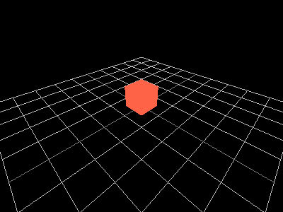
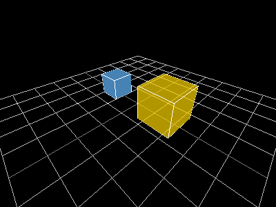
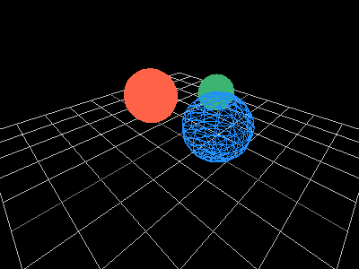
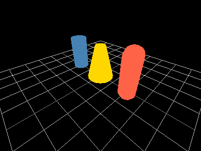
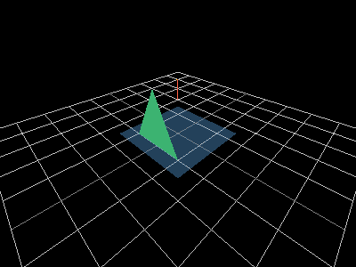
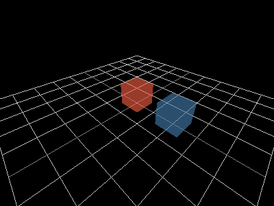
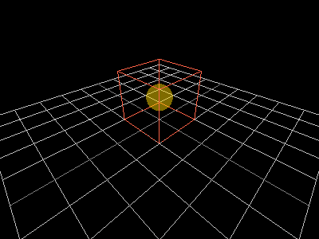

# Drawing 3D

This guide covers 3D shape rendering. Every example uses
[`raylibr_screenshot_3d()`](https://jeroenjanssens.github.io/raylibr/reference/raylibr_screenshot_3d.md),
which sets up a hidden window with a camera at `c(4, 4, 4)` looking at
the origin, draws a reference grid, then runs your drawing code.

## 3D coordinate system

Raylib uses a **right-handed** coordinate system: X points right, **Y
points up**, and Z points toward you. This is different from the 2D
system where Y points down.

## Camera

A 3D scene needs a camera.
[`camera_3d()`](https://jeroenjanssens.github.io/raylibr/reference/camera_3d.md)
creates one:

``` r

cam <- camera_3d(
  position = c(4, 4, 4),
  target = c(0, 0, 0),
  up = c(0, 1, 0),
  fovy = 70.0,
  projection = camera_projection$perspective
)
cam$position
#> x y z 
#> 4 4 4
```

The defaults (`target = c(0,0,0)`, `up = c(0,1,0)`, `fovy = 70`) work
well for most cases, so `camera_3d(c(4, 4, 4))` is usually enough. See
the
[Camera](https://jeroenjanssens.github.io/raylibr/articles/guide-camera.md)
guide for modes, controls, and coordinate conversion.

## The 3D drawing block

3D drawing calls must be wrapped in
[`begin_mode_3d()`](https://jeroenjanssens.github.io/raylibr/reference/begin_mode_3d.md)
/
[`end_mode_3d()`](https://jeroenjanssens.github.io/raylibr/reference/end_mode_3d.md):

``` r

begin_drawing()
clear_background("black")
begin_mode_3d(cam)
draw_cube(c(0, 0, 0), 2.0, 2.0, 2.0, "red")
end_mode_3d()
end_drawing()
```

[`raylibr_screenshot_3d()`](https://jeroenjanssens.github.io/raylibr/reference/raylibr_screenshot_3d.md)
handles all this boilerplate — you just provide the drawing code:

``` r

raylibr_screenshot_3d(function() {
  draw_cube(c(0, 0.5, 0), 1.0, 1.0, 1.0, "tomato")
})
```



raylibr image

## Cubes

``` r

raylibr_screenshot_3d(function() {
  draw_cube(c(-1.5, 0.5, 0), 1.0, 1.0, 1.0, "steelblue")
  draw_cube_wires(c(-1.5, 0.5, 0), 1.0, 1.0, 1.0, "white")
  draw_cube(c(1.5, 0.75, 0), 1.5, 1.5, 1.5, color_alpha("gold", 0.7))
  draw_cube_wires(c(1.5, 0.75, 0), 1.5, 1.5, 1.5, "white")
})
```



raylibr image

[`draw_cube()`](https://jeroenjanssens.github.io/raylibr/reference/draw_cube.md)
takes a center position and width/height/length as floats.
[`draw_cube_wires()`](https://jeroenjanssens.github.io/raylibr/reference/draw_cube_wires.md)
draws the wireframe outline.
[`draw_cube_v()`](https://jeroenjanssens.github.io/raylibr/reference/draw_cube_v.md)
and
[`draw_cube_wires_v()`](https://jeroenjanssens.github.io/raylibr/reference/draw_cube_wires_v.md)
accept size as a `Vector3`.

## Spheres

``` r

raylibr_screenshot_3d(function() {
  draw_sphere(c(-1.5, 1, 0), 1.0, "tomato")
  draw_sphere_wires(c(1.5, 1, 0), 1.0, 12L, 12L, "dodgerblue")
  draw_sphere_ex(c(0, 1, -2), 0.7, 16L, 16L, "mediumseagreen")
})
```



raylibr image

[`draw_sphere()`](https://jeroenjanssens.github.io/raylibr/reference/draw_sphere.md)
takes a center and radius.
[`draw_sphere_ex()`](https://jeroenjanssens.github.io/raylibr/reference/draw_sphere_ex.md)
adds control over the number of rings and slices (more = smoother).
[`draw_sphere_wires()`](https://jeroenjanssens.github.io/raylibr/reference/draw_sphere_wires.md)
draws a wireframe sphere.

## Cylinders and capsules

``` r

raylibr_screenshot_3d(function() {
  draw_cylinder(c(-2, 0, 0), 0.5, 0.5, 2.0, 16L, "steelblue")
  draw_cylinder_ex(c(0, 0, 0), c(0, 2, 0), 0.8, 0.3, 16L, "gold")
  draw_capsule(c(2, 0, 0), c(2, 2, 0), 0.5, 8L, 8L, "tomato")
})
```



raylibr image

[`draw_cylinder()`](https://jeroenjanssens.github.io/raylibr/reference/draw_cylinder.md)
takes a base position, top/bottom radii, height, and slices.
[`draw_cylinder_ex()`](https://jeroenjanssens.github.io/raylibr/reference/draw_cylinder_ex.md)
takes start and end points for arbitrary orientation.
[`draw_capsule()`](https://jeroenjanssens.github.io/raylibr/reference/draw_capsule.md)
is a cylinder with rounded ends.

## Planes and lines

``` r

raylibr_screenshot_3d(function() {
  draw_plane(c(0, 0, 0), c(3, 3), color_alpha("steelblue", 0.5))
  draw_line_3d(c(-2, 0, -2), c(2, 3, 2), "tomato")
  draw_point_3d(c(0, 2, 0), "gold")
  draw_triangle_3d(
    c(-1, 0, 1), c(1, 0, 1), c(0, 2, 1),
    "mediumseagreen"
  )
})
```



raylibr image

[`draw_plane()`](https://jeroenjanssens.github.io/raylibr/reference/draw_plane.md)
draws a flat quad at a given position with a given size.

## Grid

[`draw_grid()`](https://jeroenjanssens.github.io/raylibr/reference/draw_grid.md)
renders a reference grid on the XZ plane, centered at the origin.
[`raylibr_screenshot_3d()`](https://jeroenjanssens.github.io/raylibr/reference/raylibr_screenshot_3d.md)
includes `draw_grid(10L, 1.0)` automatically:

``` r

raylibr_screenshot_3d(function() {
  # The grid is already drawn by raylibr_screenshot_3d()
  # Just add something to see the scale
  draw_cube(c(0, 0.5, 0), 1.0, 1.0, 1.0, color_alpha("tomato", 0.6))
  draw_cube(c(2, 0.5, 0), 1.0, 1.0, 1.0, color_alpha("steelblue", 0.6))
})
```



raylibr image

Each grid square is 1 unit wide. The cubes above are 1 unit on each
side, spaced 2 units apart.

## Bounding boxes

[`bounding_box()`](https://jeroenjanssens.github.io/raylibr/reference/bounding_box.md)
defines an axis-aligned box by its min and max corners. Useful for
collision detection and visualization:

``` r

raylibr_screenshot_3d(function() {
  bb <- bounding_box(c(-1, 0, -1), c(1, 2, 1))
  draw_bounding_box(bb, "tomato")
  draw_sphere(c(0, 1, 0), 0.5, color_alpha("gold", 0.5))
})
```



raylibr image

## Models

For complex 3D objects, load models from files with
[`load_model()`](https://jeroenjanssens.github.io/raylibr/reference/load_model.md)
and draw them with
[`draw_model()`](https://jeroenjanssens.github.io/raylibr/reference/draw_model.md).
See the [3D Model
demo](https://jeroenjanssens.github.io/raylibr/articles/demo-model.md)
for a complete example with textures and post-processing shaders.
