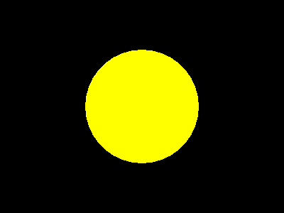
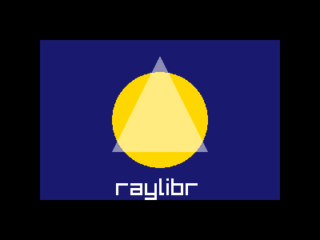

# Getting Started

## Installation

raylibr is not yet on CRAN. Install the development version from GitHub:

``` r

pak::pak("jeroenjanssens/raylibr")
```

raylibr works on macOS, Linux, and Windows. It also runs in the browser
via
[webR](https://jeroenjanssens.github.io/raylibr/articles/guide-webr.md).

## Your first image

The quickest way to see raylibr in action is
[`raylibr_screenshot()`](https://jeroenjanssens.github.io/raylibr/reference/raylibr_screenshot.md).
It creates a hidden window, runs your drawing code, and returns the
result as an image:

``` r

raylibr_screenshot(function() {
  draw_circle(200L, 150L, 80.0, "yellow")
})
```



raylibr image

The default canvas is 400x300 pixels with a black background. Everything
you draw appears on top.

You can compose multiple shapes in a single screenshot:

``` r

raylibr_screenshot(function() {
  draw_rectangle(50L, 50L, 300L, 200L, "midnightblue")
  draw_circle(200L, 150L, 60.0, "gold")
  draw_triangle(
    c(200, 70), c(140, 190), c(260, 190),
    color_alpha("white", 0.5)
  )
  draw_text("raylibr", 145L, 220L, 30L, "white")
})
```



raylibr image

## The game loop

Raylib renders frame by frame: each iteration of a loop draws one frame
to the screen. This is different from R’s typical batch execution model.

The classic pattern looks like this:

``` r

init_window(800L, 600L, "My Game")
set_target_fps(60L)

while (!window_should_close()) {
  begin_drawing()
  clear_background("black")
  draw_text("Hello!", 300L, 280L, 40L, "white")
  end_drawing()
}

close_window()
```

For code that needs to work both on desktop and in the browser (via
webR), use
[`run_game_loop()`](https://jeroenjanssens.github.io/raylibr/reference/run_game_loop.md)
instead of a `while` loop:

``` r

run_game_loop(
  init_fn = function() {
    init_window(800L, 600L, "My Game")
    set_target_fps(60L)
  },
  update_fn = function() {
    begin_drawing()
    clear_background("black")
    draw_text("Hello!", 300L, 280L, 40L, "white")
    end_drawing()
  },
  cleanup_fn = close_window
)
```

## Conventions

raylibr follows a few consistent conventions:

**snake_case names.** Raylib’s `DrawCircle()` becomes
[`draw_circle()`](https://jeroenjanssens.github.io/raylibr/reference/draw_circle.md).

**Integers need `L`.** Width, height, pixel coordinates, and font sizes
are integers. Write `200L`, not `200`.

**R color names work everywhere.** Any function that takes a color
accepts R’s 657 built-in color names: `"red"`, `"steelblue"`,
`"grey90"`, etc. See the
[Colors](https://jeroenjanssens.github.io/raylibr/articles/guide-colors.md)
guide for details.

**Vectors map to R numerics.** A Raylib `Vector2` is `c(x, y)`, a
`Vector3` is `c(x, y, z)`, and a `Vector4` is `c(x, y, z, w)`. A Raylib
`Matrix` is a 4x4 R matrix.

## Structs

Some Raylib types have dedicated constructors:

``` r

rec <- rectangle(10, 20, 300, 200)
rec$width
#> [1] 300

cam <- camera_3d(c(4, 4, 4))
cam$fovy
#> [1] 70

bb <- bounding_box(c(-1, -1, -1), c(1, 1, 1))
bb$min
#>  x  y  z 
#> -1 -1 -1
```

Other constructors include
[`color()`](https://jeroenjanssens.github.io/raylibr/reference/color.md),
[`ray()`](https://jeroenjanssens.github.io/raylibr/reference/ray.md),
[`camera_2d()`](https://jeroenjanssens.github.io/raylibr/reference/camera_2d.md),
[`ray_collision()`](https://jeroenjanssens.github.io/raylibr/reference/ray_collision.md),
and
[`transform()`](https://jeroenjanssens.github.io/raylibr/reference/transform.md).

Check types with predicates:

``` r

is_rectangle(rec)
#> [1] TRUE
is_color("red")
#> [1] TRUE
```

## Enums

Raylib enums are available as named lists:

``` r

flag$window_resizable
#> [1] 4
key$space
#> [1] 32
mouse_button$left
#> [1] 0
camera_mode$orbital
#> [1] 2
```

Use them with functions like `set_config_flags(flag$window_resizable)`
or `is_key_pressed(key$space)`.

## What’s next

- [Drawing 2D
  Shapes](https://jeroenjanssens.github.io/raylibr/articles/guide-drawing-2d.md)
  — circles, rectangles, lines, and more
- [Drawing
  3D](https://jeroenjanssens.github.io/raylibr/articles/guide-drawing-3d.md)
  — cubes, spheres, and cameras
- [Colors](https://jeroenjanssens.github.io/raylibr/articles/guide-colors.md)
  — R color names, transparency, HSV, and blending
- [Text &
  Fonts](https://jeroenjanssens.github.io/raylibr/articles/guide-text.md)
  — rendering text and loading custom fonts
- [Images &
  Textures](https://jeroenjanssens.github.io/raylibr/articles/guide-images.md)
  — loading, generating, and drawing images
- [Input](https://jeroenjanssens.github.io/raylibr/articles/guide-input.md)
  — keyboard, mouse, and gamepad
- [Audio](https://jeroenjanssens.github.io/raylibr/articles/guide-audio.md)
  — sound effects and music
- [Camera](https://jeroenjanssens.github.io/raylibr/articles/guide-camera.md)
  — 2D and 3D camera systems
- [Shaders](https://jeroenjanssens.github.io/raylibr/articles/guide-shaders.md)
  — GLSL shaders and post-processing
- [raygui](https://jeroenjanssens.github.io/raylibr/articles/guide-raygui.md)
  — immediate-mode GUI widgets
- [raymath](https://jeroenjanssens.github.io/raylibr/articles/guide-raymath.md)
  — vector, matrix, and quaternion math
- [webR](https://jeroenjanssens.github.io/raylibr/articles/guide-webr.md)
  — running raylibr in the browser
