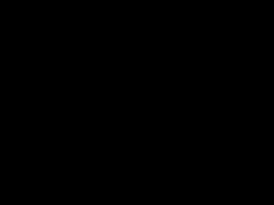

# Images & Textures

Raylib distinguishes between **images** (pixel data in CPU memory) and
**textures** (pixel data uploaded to the GPU). Images can be manipulated
freely. Textures can be drawn to the screen.

The typical pipeline is: load or generate an image, optionally
manipulate it, upload it as a texture, draw the texture.

## Generating images

raylibr can generate several kinds of procedural images:

``` r

raylibr_screenshot(function() {
  imgs <- list(
    gen_image_checked(200L, 150L, 20L, 20L, as_color("darkgray"), as_color("gray")),
    gen_image_gradient_linear(200L, 150L, 0L, as_color("darkblue"), as_color("skyblue")),
    gen_image_perlin_noise(200L, 150L, 0L, 0L, 4.0),
    gen_image_cellular(200L, 150L, 16L)
  )
  positions <- list(c(0L, 0L), c(200L, 0L), c(0L, 150L), c(200L, 150L))
  for (i in seq_along(imgs)) {
    tex <- load_texture_from_image(imgs[[i]])
    draw_texture(tex, positions[[i]][1], positions[[i]][2], as_color("white"))
    unload_texture(tex)
    unload_image(imgs[[i]])
  }
})
```


raylibr image

Top-left: checkerboard (`gen_image_checked`). Top-right: linear gradient
(`gen_image_gradient_linear`). Bottom-left: Perlin noise
(`gen_image_perlin_noise`). Bottom-right: cellular/Voronoi
(`gen_image_cellular`).

Other generators include
[`gen_image_color()`](https://jeroenjanssens.github.io/raylibr/reference/gen_image_color.md),
[`gen_image_gradient_radial()`](https://jeroenjanssens.github.io/raylibr/reference/gen_image_gradient_radial.md),
[`gen_image_gradient_square()`](https://jeroenjanssens.github.io/raylibr/reference/gen_image_gradient_square.md),
and
[`gen_image_white_noise()`](https://jeroenjanssens.github.io/raylibr/reference/gen_image_white_noise.md).

## Loading images

Load an image from a file with
[`load_image()`](https://jeroenjanssens.github.io/raylibr/reference/load_image.md):

``` r

img <- load_image("photo.png")
# Supported formats: PNG, BMP, TGA, JPG, GIF, PSD, HDR, PIC, PNM, KTX, ASTC, DDS, PKM
```

Check validity with `is_image_valid(img)` and free memory with
`unload_image(img)`.

## Image manipulation

Images live in CPU memory, so you can modify them before uploading to
the GPU:

``` r

copy <- image_copy(img)
sub <- image_from_image(img, rectangle(0, 0, 100, 100))
channel <- image_from_channel(img, 0L)
```

You can also draw onto images with
[`image_draw_line_ex()`](https://jeroenjanssens.github.io/raylibr/reference/image_draw_line_ex.md)
and
[`image_draw_triangle()`](https://jeroenjanssens.github.io/raylibr/reference/image_draw_triangle.md).

## Drawing textures

Convert an image to a texture with
[`load_texture_from_image()`](https://jeroenjanssens.github.io/raylibr/reference/load_texture_from_image.md),
or load directly with
[`load_texture()`](https://jeroenjanssens.github.io/raylibr/reference/load_texture.md):

``` r

raylibr_screenshot(function() {
  img <- gen_image_checked(64L, 64L, 8L, 8L, as_color("purple"), as_color("mediumpurple"))
  tex <- load_texture_from_image(img)
  unload_image(img)

  draw_texture(tex, 20L, 20L, as_color("white"))
  draw_texture_ex(tex, c(120, 20), 30.0, 2.0, as_color("white"))
  draw_texture_pro(
    tex,
    rectangle(0, 0, 64, 64),
    rectangle(280, 80, 128, 128),
    c(64, 64), 45.0, as_color("white")
  )
  unload_texture(tex)
})
```



raylibr image

- [`draw_texture()`](https://jeroenjanssens.github.io/raylibr/reference/draw_texture.md)
  draws at a position with a tint color
- [`draw_texture_ex()`](https://jeroenjanssens.github.io/raylibr/reference/draw_texture_ex.md)
  adds rotation and scale
- [`draw_texture_pro()`](https://jeroenjanssens.github.io/raylibr/reference/draw_texture_pro.md)
  gives full control: source rectangle, destination rectangle, origin,
  and rotation

## Render textures

A render texture lets you draw to an off-screen buffer, then use the
result as a regular texture. This is the basis for post-processing
effects:

``` r

target <- load_render_texture(800L, 600L)

begin_texture_mode(target)
  clear_background("black")
  draw_circle(400L, 300L, 100.0, "red")
end_texture_mode()

begin_drawing()
  draw_texture_rec(
    target$texture,
    rectangle(0, 0, 800, -600),
    c(0, 0), "white"
  )
end_drawing()

unload_render_texture(target)
```

Note the negative height in the source rectangle – render textures are
flipped vertically in OpenGL.

## Exporting images

Save an image to disk:

``` r

img <- load_image_from_screen()
export_image(img, "screenshot.png")
```

Supported export formats: PNG, BMP, TGA, JPG, KTX, RAW.
