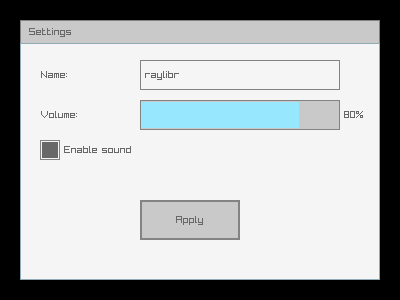
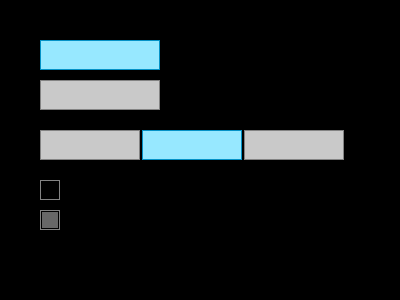
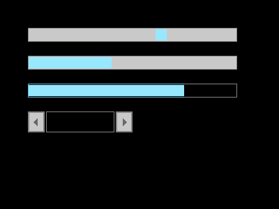
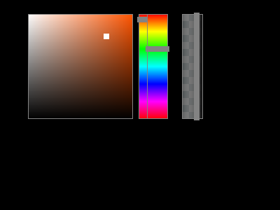

# raygui

raygui is an **immediate-mode** GUI library bundled with raylibr. Unlike
retained-mode GUI toolkits (where you create widgets once and query
their state), immediate-mode GUIs call a function for each control every
frame. The function draws the control and returns its current value or
interaction state.

## Layout

Every control is positioned with a `rectangle(x, y, width, height)`.
There is no automatic layout — you place each control explicitly.

``` r

raylibr_screenshot(function() {
  gui_panel(rectangle(20, 20, 360, 260), "Settings")
  gui_label(rectangle(40, 60, 100, 30), "Name:")
  gui_text_box(rectangle(140, 60, 200, 30), "raylibr", 64L, FALSE)
  gui_label(rectangle(40, 100, 100, 30), "Volume:")
  gui_slider_bar(rectangle(140, 100, 200, 30), "", "80%", 0.8, 0, 1)
  gui_check_box(rectangle(40, 140, 20, 20), "Enable sound", TRUE)
  gui_button(rectangle(140, 200, 100, 40), "Apply")
})
```



raylibr image

## Buttons and labels

[`gui_button()`](https://jeroenjanssens.github.io/raylibr/reference/gui_button.md)
draws a clickable button and returns `TRUE` when clicked:

``` r

if (gui_button(rectangle(100, 100, 120, 40), "Click me")) {
  # handle click
}
```

[`gui_label()`](https://jeroenjanssens.github.io/raylibr/reference/gui_label.md)
draws static text.
[`gui_label_button()`](https://jeroenjanssens.github.io/raylibr/reference/gui_label_button.md)
is a clickable text label.

## Toggles and checkboxes

``` r

raylibr_screenshot(function() {
  gui_toggle(rectangle(40, 40, 120, 30), "Option A", TRUE)
  gui_toggle(rectangle(40, 80, 120, 30), "Option B", FALSE)
  gui_toggle_group(rectangle(40, 130, 100, 30), "Low;Medium;High", 1L)
  gui_check_box(rectangle(40, 180, 20, 20), "Fullscreen", FALSE)
  gui_check_box(rectangle(40, 210, 20, 20), "VSync", TRUE)
})
```



raylibr image

[`gui_toggle()`](https://jeroenjanssens.github.io/raylibr/reference/gui_toggle.md)
returns the new active state.
[`gui_toggle_group()`](https://jeroenjanssens.github.io/raylibr/reference/gui_toggle_group.md)
shows multiple options and returns the selected index.
[`gui_check_box()`](https://jeroenjanssens.github.io/raylibr/reference/gui_check_box.md)
returns the new checked state.

## Sliders and progress bars

``` r

raylibr_screenshot(function() {
  gui_slider(rectangle(40, 40, 300, 20), "0", "100", 65, 0, 100)
  gui_slider_bar(rectangle(40, 80, 300, 20), "Vol", "", 0.4, 0, 1)
  gui_progress_bar(rectangle(40, 120, 300, 20), "", "75%", 0.75, 0, 1)
  gui_spinner(rectangle(40, 160, 150, 30), "", 42L, 0L, 100L, FALSE)
})
```



raylibr image

[`gui_slider()`](https://jeroenjanssens.github.io/raylibr/reference/gui_slider.md)
and
[`gui_slider_bar()`](https://jeroenjanssens.github.io/raylibr/reference/gui_slider_bar.md)
return the new value.
[`gui_progress_bar()`](https://jeroenjanssens.github.io/raylibr/reference/gui_progress_bar.md)
is display-only.
[`gui_spinner()`](https://jeroenjanssens.github.io/raylibr/reference/gui_spinner.md)
shows a value with +/- buttons.

## Text input

[`gui_text_box()`](https://jeroenjanssens.github.io/raylibr/reference/gui_text_box.md)
renders an editable text field. The `edit_mode` parameter controls
whether it’s active for input:

``` r

text <- gui_text_box(rectangle(40, 40, 200, 30), text, 256L, edit_mode)
```

[`gui_combo_box()`](https://jeroenjanssens.github.io/raylibr/reference/gui_combo_box.md)
shows a dropdown-style selector,
[`gui_dropdown_box()`](https://jeroenjanssens.github.io/raylibr/reference/gui_dropdown_box.md)
shows an expandable list.

## Color controls

``` r

raylibr_screenshot(function() {
  gui_color_picker(rectangle(40, 20, 150, 150), "", color(200L, 100L, 50L))
  gui_color_bar_hue(rectangle(210, 20, 30, 150), "", 120)
  gui_color_bar_alpha(rectangle(260, 20, 30, 150), "", 0.7)
})
```



raylibr image

[`gui_color_picker()`](https://jeroenjanssens.github.io/raylibr/reference/gui_color_picker.md)
returns a color.
[`gui_color_bar_hue()`](https://jeroenjanssens.github.io/raylibr/reference/gui_color_bar_hue.md)
returns a hue value (0-360).
[`gui_color_bar_alpha()`](https://jeroenjanssens.github.io/raylibr/reference/gui_color_bar_alpha.md)
returns an alpha value (0-1).

## Containers

- `gui_panel(bounds, text)` — a bordered panel with an optional title
- `gui_group_box(bounds, text)` — a labeled group outline
- `gui_window_box(bounds, text)` — a window with a close button (returns
  `TRUE` when closed)
- `gui_scroll_panel(bounds, text, content, scroll, view)` — scrollable
  area for content larger than the visible region

## Styling

Customize the look of controls with
[`gui_set_style()`](https://jeroenjanssens.github.io/raylibr/reference/gui_set_style.md):

``` r

# Set a property for a specific control type
gui_set_style(gui_control$button, gui_control_property$text_color_normal, 0xFF0000FF)

# Load a complete style file
gui_load_style("my_style.rgs")

# Reset to defaults
gui_load_style_default()
```

State functions control whether controls are interactive:

``` r

gui_disable()  # gray out all controls
gui_enable()   # re-enable
gui_lock()     # controls visible but non-interactive
gui_unlock()
```

## Further reading

See the [GUI Controls
demo](https://jeroenjanssens.github.io/raylibr/articles/demo-gui.md) for
a complete interactive example with all major control types.
