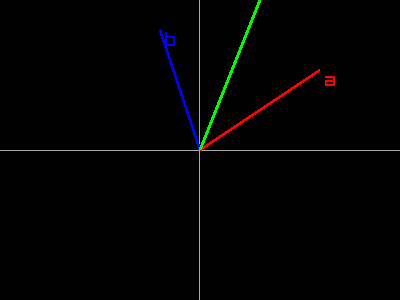
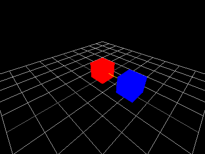

# raymath

raylibr includes the full raymath library — vector, matrix, and
quaternion operations commonly needed in graphics programming. These use
plain R types, so standard R operations work alongside raymath
functions.

## R types as math types

| raymath type         | R representation         | Example            |
|:---------------------|:-------------------------|:-------------------|
| Vector2              | `numeric(2)`             | `c(1.0, 2.0)`      |
| Vector3              | `numeric(3)`             | `c(1.0, 2.0, 3.0)` |
| Vector4 / Quaternion | `numeric(4)`             | `c(0, 0, 0, 1)`    |
| Matrix               | `matrix(nrow=4, ncol=4)` | `diag(4)`          |

No wrapper classes — just plain R numerics and matrices.

## Float utilities

Basic math helpers that mirror GLSL built-in functions:

``` r

float_lerp(0, 10, 0.25)
#> [1] 2.5
float_clamp(15, 0, 10)
#> [1] 10
float_remap(5, 0, 10, 100, 200)
#> [1] 150
```

## Vector2 operations

Arithmetic, geometry, and interpolation on 2D vectors:

``` r

vector2_add(c(1, 2), c(3, 4))
#> x y 
#> 4 6
vector2_length(c(3, 4))
#> [1] 5
vector2_normalize(c(3, 4))
#>   x   y 
#> 0.6 0.8
vector2_distance(c(0, 0), c(3, 4))
#> [1] 5
vector2_dot_product(c(1, 0), c(0, 1))
#> [1] 0
vector2_lerp(c(0, 0), c(10, 10), 0.5)
#> x y 
#> 5 5
vector2_rotate(c(1, 0), pi / 2)
#>             x             y 
#> -4.371139e-08  1.000000e+00
```

Visualized — adding vectors `a` and `b`:

``` r

raylibr_screenshot(function() {
  ox <- 200L; oy <- 150L; s <- 40

  draw_line(0L, oy, 400L, oy, "darkgray")
  draw_line(ox, 0L, ox, 300L, "darkgray")

  a <- c(3, 2)
  draw_line_ex(c(ox, oy), c(ox + a[1]*s, oy - a[2]*s), 3.0, "red")
  draw_text("a", as.integer(ox + a[1]*s + 5), as.integer(oy - a[2]*s), 20L, "red")

  b <- c(-1, 3)
  draw_line_ex(c(ox, oy), c(ox + b[1]*s, oy - b[2]*s), 3.0, "blue")
  draw_text("b", as.integer(ox + b[1]*s + 5), as.integer(oy - b[2]*s), 20L, "blue")

  ab <- vector2_add(a, b)
  draw_line_ex(c(ox, oy), c(ox + ab[1]*s, oy - ab[2]*s), 3.0, "green")
  draw_text("a+b", as.integer(ox + ab[1]*s + 5), as.integer(oy - ab[2]*s), 20L, "green")
})
```



raylibr image

Other useful Vector2 functions:
[`vector2_scale()`](https://jeroenjanssens.github.io/raylibr/reference/vector2_scale.md),
[`vector2_multiply()`](https://jeroenjanssens.github.io/raylibr/reference/vector2_multiply.md),
[`vector2_negate()`](https://jeroenjanssens.github.io/raylibr/reference/vector2_negate.md),
[`vector2_reflect()`](https://jeroenjanssens.github.io/raylibr/reference/vector2_reflect.md),
[`vector2_clamp()`](https://jeroenjanssens.github.io/raylibr/reference/vector2_clamp.md),
[`vector2_move_towards()`](https://jeroenjanssens.github.io/raylibr/reference/vector2_move_towards.md).

## Vector3 operations

The same operations extend to 3D, plus a few new ones:

``` r

vector3_add(c(1, 2, 3), c(4, 5, 6))
#> x y z 
#> 5 7 9
vector3_cross_product(c(1, 0, 0), c(0, 1, 0))
#> x y z 
#> 0 0 1
vector3_length(c(1, 2, 2))
#> [1] 3
vector3_normalize(c(1, 2, 2))
#>         x         y         z 
#> 0.3333333 0.6666667 0.6666667
```

[`vector3_cross_product()`](https://jeroenjanssens.github.io/raylibr/reference/vector3_cross_product.md)
returns a vector perpendicular to both inputs — essential for computing
surface normals and orientation.

``` r

raylibr_screenshot_3d(function() {
  draw_cube(c(0, 0.5, 0), 1, 1, 1, "red")

  pos <- vector3_add(c(0, 0.5, 0), c(2, 0, 0))
  draw_cube(pos, 1, 1, 1, "blue")

  draw_line_3d(c(0, 0.5, 0), pos, "yellow")
})
```



raylibr image

Other key functions:
[`vector3_rotate_by_axis_angle()`](https://jeroenjanssens.github.io/raylibr/reference/vector3_rotate_by_axis_angle.md),
[`vector3_project()`](https://jeroenjanssens.github.io/raylibr/reference/vector3_project.md),
[`vector3_reject()`](https://jeroenjanssens.github.io/raylibr/reference/vector3_reject.md),
[`vector3_unproject()`](https://jeroenjanssens.github.io/raylibr/reference/vector3_unproject.md),
[`vector3_barycenter()`](https://jeroenjanssens.github.io/raylibr/reference/vector3_barycenter.md),
[`vector3_ortho_normalize()`](https://jeroenjanssens.github.io/raylibr/reference/vector3_ortho_normalize.md).

## Matrix operations

Matrices represent transformations — translation, rotation, and scaling:

``` r

m <- matrix_identity()
m <- matrix_multiply(m, matrix_translate(1, 2, 3))
m <- matrix_multiply(m, matrix_rotate(c(0, 1, 0), pi / 4))
m <- matrix_multiply(m, matrix_scale(2, 2, 2))
```

Matrix multiplication chains transforms. The order matters: the
rightmost transform is applied first.

Camera-related matrices:

``` r

view <- matrix_look_at(c(4, 4, 4), c(0, 0, 0), c(0, 1, 0))
proj <- matrix_perspective(70 * pi / 180, 4/3, 0.1, 100)
```

Decompose a matrix back into its components:

``` r

m <- matrix_multiply(matrix_translate(1, 2, 3), matrix_scale(2, 2, 2))
parts <- matrix_decompose(m)
parts$translation
#> x y z 
#> 2 4 6
parts$scale
#> x y z 
#> 2 2 2
```

## Quaternions

Quaternions represent 3D rotations without gimbal lock. They’re stored
as `c(x, y, z, w)`:

``` r

q1 <- quaternion_from_euler(0, pi/4, 0)
q2 <- quaternion_from_axis_angle(c(0, 1, 0), pi/2)

# Smooth interpolation between two rotations
q_mid <- quaternion_slerp(q1, q2, 0.5)

# Convert to a matrix for use with draw_model_ex() etc.
mat <- quaternion_to_matrix(q_mid)
```

[`quaternion_slerp()`](https://jeroenjanssens.github.io/raylibr/reference/quaternion_slerp.md)
(Spherical Linear intERPolation) produces smooth rotation transitions —
essential for animation.

Other quaternion functions:
[`quaternion_normalize()`](https://jeroenjanssens.github.io/raylibr/reference/quaternion_normalize.md),
[`quaternion_invert()`](https://jeroenjanssens.github.io/raylibr/reference/quaternion_invert.md),
[`quaternion_multiply()`](https://jeroenjanssens.github.io/raylibr/reference/quaternion_multiply.md),
[`quaternion_from_matrix()`](https://jeroenjanssens.github.io/raylibr/reference/quaternion_from_matrix.md),
[`quaternion_to_euler()`](https://jeroenjanssens.github.io/raylibr/reference/quaternion_to_euler.md),
[`quaternion_nlerp()`](https://jeroenjanssens.github.io/raylibr/reference/quaternion_nlerp.md).
