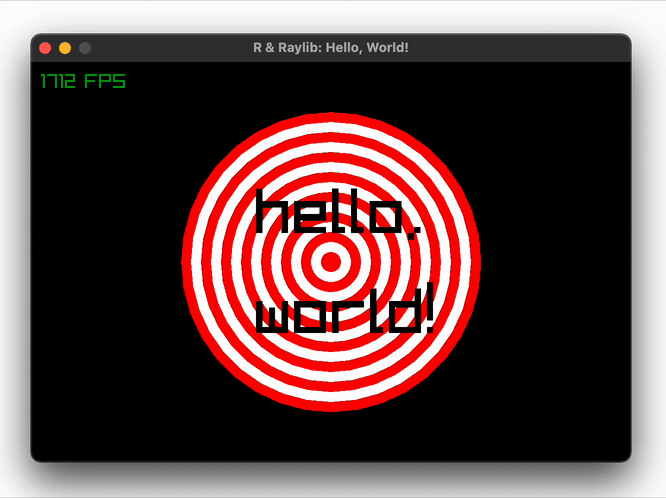

The simplest raylibr demo: open a window, draw a pulsing set of concentric circles, and fade two text labels in and out using `sin()` over time. It demonstrates the core game loop (`begin_drawing()` / `end_drawing()`), vectorized `draw_circle()` and `draw_text()` calls, `fade()` for transparency, and `draw_fps()` for a frame-rate overlay.



## Run

```r
demo("helloworld", package = "raylibr")
```

## Source code

```r
library(raylibr)

init_window(600, 400, "R & Raylib: Hello, World!")

while (!window_should_close()) {
  alpha <- abs(sin(get_time()))
  begin_drawing()
  clear_background("black")
  draw_circle(300, 200, seq(150, 10, by = -10), c("red", "white"))
  draw_text(c("hello,", "world!"), 225, c(120, 220), 64, fade("black", alpha))
  draw_fps(10, 10)
  end_drawing()
}

close_window()
```
